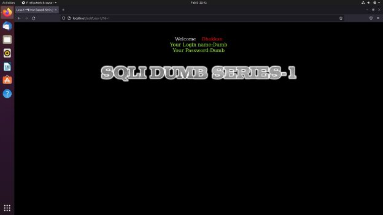
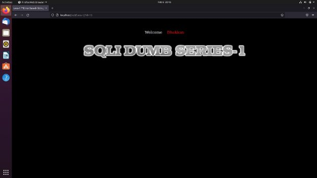
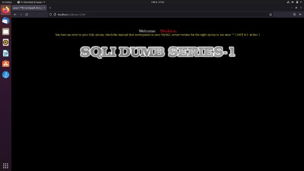
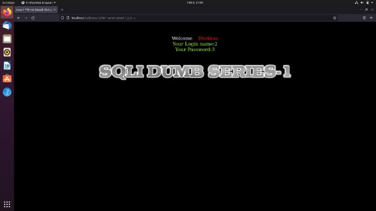
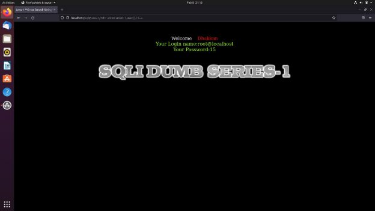
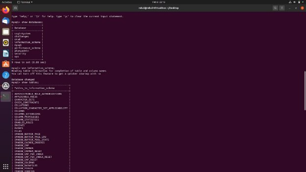
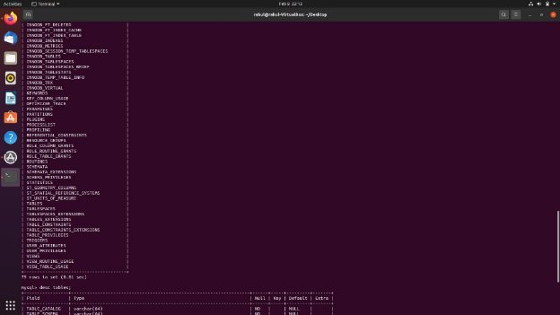
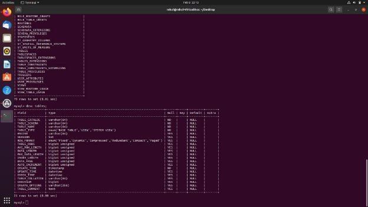
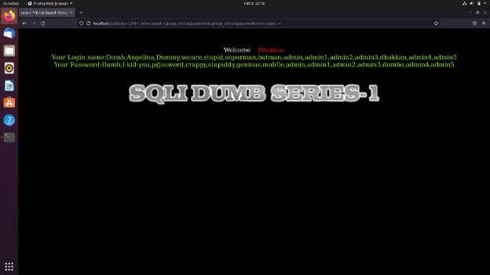

**SQLI LABS** - *LESS1*

We start by testing the ID parameter in with a numeric value, thereby we add **?id=1** Now when we run or execute the URL again we get a login name and password.

With a different login name and password, every different numeric entry puts out a different login and password data.

When we brute force and continually change the numeric value one by one we come to an end at 14.

Now when we use **‘** after the numeric value that was modified in the URL it gives us the following error. Allowing us to use this point as a SQL injection point.

Now using this point we will proceed and continue retrieving the other stored data from the Database.

To avoid the error we will be commenting out the query from the URL which will allow us in successful injection.

Now we will continue by doing a union attack to retrieve data from the database and at the same time also commenting the query.

Now we can use the union attack functionality as padding and get the SQL query injected directly into the Database.

Here we use **user()** to find the current user of the URL or the page, we can also apply other such queries like **version(), database(),** and **current\_user().**

We will continue by analyzing the Database and Schema or table design using mysql , by using and analyzing the tables and schemas we will be able to find the target table and column which has the information or data.

In this particular case we use the following queries:

- ?id=1’ union select 1,group\_concat(table\_name),3 table\_schema.tables where table\_schema=database() --+
- ?id=1’ union select 1,group\_concat(column\_name),3 table\_schema.columns tables where table\_name=’users’ --+
- ?id=1’ union select 1,group\_concat(username),group\_concat(password) from users --+

This will give us the following output:

