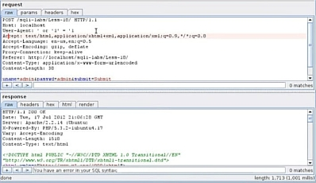

This is the PHP code of the website” http://localhost/sqli/Less-18/ “, we have opened it up to analyse and understand why we can’t simply break the query and extract data from the present fields on the webpage.

This part of the PHP code is basically a function that makes sure that the username and the password fields of the database are non-injectable.

Here we find an insert query where there is a insert into the:

Uagents

ip\_address

username 

**PAYLOAD:** INSERT INTO `security`.`uagents` (`uagent`, `ip\_address`, `username`) VALUES ('mozilla', '127.0.0.1', 'test');

Now we will be changing the parameters of the values using the SQL query to mozilla, 127.0.0.1, test.

` `Now lets tru to fuzz the login page

We get a message that we had edited earlier

Now using burp suite we edit the user agent value so that we can use sql injection payloads and fuzz the database to extract some data from the database.

**PAYLOAD:** ‘ or ‘1’ = ’1
