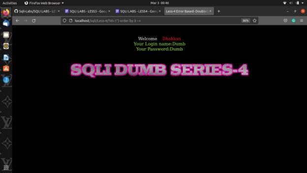
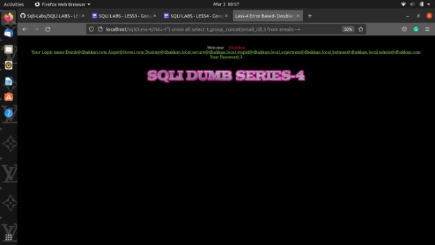

**SQLI LABS** - *LESS3*

We start by testing the ID parameter in with a numeric value, thereby we add **?id=1** Now here we run into a error "You have an error in your SQL syntax; check the manual that corresponds to your MySQL server version for the right syntax to use near ''-1\') LIMIT 0,1' at line 1" thereby we make a few changes in the id parameter " ?id=-1') ".

 
 
 By using the order functionality we will be able to see the number of tables that are committed to the database, in this case, it is 3.
 
 
 
 Now we perform a union attack on the URL and we find that 2 and 3 are vulnerable and can be injected to retrieve data.

Now we can use the union attack functionality as padding and get the SQL query injected directly into the Database.

We will get the names of the tales that are present in the database using the following query And list them.

Now we will replace the tables by columns and collect the data from the user by group concat functionality in the URL.

On executing this it will give us a list of usernames and passcodes as follows:

